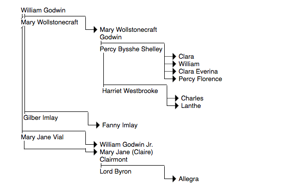
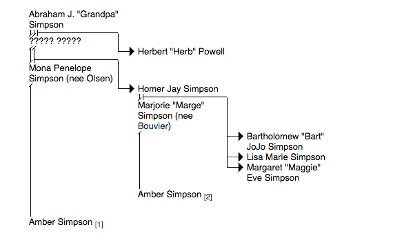
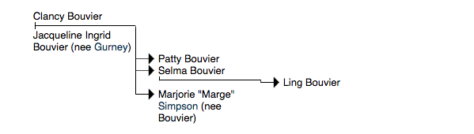

# Tree jQuery Plugin #

jQuery plugin to aide in the presentation of semantically meaningful tree data in HTML.

Trees are coded as a nested list. The HTML is simple, as it should be. JavaScript is only used for the purposes of manipulating the background images of each element, in order to draw the connections between nodes without burdening the encoder with a different CSS class for every collection of relationships. 

If it is desired, Firebug or any similar tool may be used to copy the rendered code, resulting in static, semantically meaningful code that may be used in a JavaScript-free environment.

It should also be noted that this formatting relies upon CSS3 support for multiple background images.

## Examples ##

For functional versions of these examples, see the examples.html

### Example 1: Basic Usage ###

Here's the simplest implementation of a family tree:

And here's the code:

    <ul class='family'>
      <li>Parent 1
        <ul class='partners'>
          <li>Parent 2
            <ul class='children'>
              <li>Birth Child</li>
              <li class='adopted'>Adopted Child</li>
            </ul>
          </li>
        </ul>
      </li>
    </ul>

Every list element represents a person, and every person may contain a sublist defining their relations (either partners or children).

### Example 2: Advanced Usage ###

Here's a much more complicated implementation, based on Mary Wollstonecraft Shelley's family tree (from [wikipedia](http://en.wikipedia.org/wiki/File:Family_tree_of_Mary_Wollstonecraft_Shelley.gif):

This shows that individuals can have multiple partners. Further, those partners can further partners of their own, with whom they can even have a distinct set of children, as in the Mary - Percy - Harriet relationship. Here's the code from that branch:

    <li>Mary Wollstonecraft Godwin
      <ul class='partners'>
        <li>Percy Bysshe Shelley
          <ul class='children'>
            <li>Clara</li><li>William</li><li>Clara Everina</li><li>Percy Florence</li>
          </ul>
          <ul class='partners'>
            <li>Harriet Westbrooke
              <ul class='children'>
                <li>Charles</li><li>Lanthe</li>
              </ul>
            </li>
          </ul>
        </li>
      </ul>
    </li>

Note also the case of Mary Jane Vial. She has two sets of children; one born to William Godwin, and her own, to which she was initially a single mother (These children were born to Sir John Lethbridge out of wedlock; I could have included him, but wanted to demonstrate a coupling with a single parent). This is handled through the use of two "children" lists. In such cases, the second list is portrayed as the individual's sole children. Here's the relevant code:

    <ul class='family'> 
    <li>
      William Godwin 
      ... snip ... 
      <li>Mary Jane Vial 
        <ul class='children'> 
          <li>William Godwin Jr.</li> 
        </ul> 
        <ul class='children'> 
          <li>
            Mary Jane (Claire) Clairmont 
            <ul class='partners'> 
              <li>Lord Byron 
                <ul class='children'> 
                  <li>Allegra</li> 
                </ul> 
              </li> 
            </ul> 
          </li> 
        </ul> 
      </li> 
    </li> 
    </ul>
  
### Example 3: Family Mergers ###

Unfortunately, nested lists can't handle anything that deviates very much from a direct line of descent. It's not a true tree, and so demonstrating a true merging of families is impossible. The best we can do is provide hyperlinks at points where trees connect, as done in this collection of Simpsons family trees:

#### Simspon Family ####

#### Bouvier Family ####

#### Gurney Family ####

Since there is no way to handle a true merging of family trees in this schema, I've separated the Simpson, Bouvier, and Gurney (Marge's mother's given name). I've also used hyperlinks to handle cases where one person must occupy two spots in the same family tree (as necessitated by Homer's second wife Amber, who also went on to be Abe's second wife, in the episode ["Brawl in the Family"](http://en.wikipedia.org/wiki/Brawl_in_the_Family)).

## Author ##

Craig McIntosh  
craigmc.info

## Licence ##

This work is licensed under a [Creative Commons Attribution 3.0 Unported License](http://creativecommons.org/licenses/by/3.0/).

